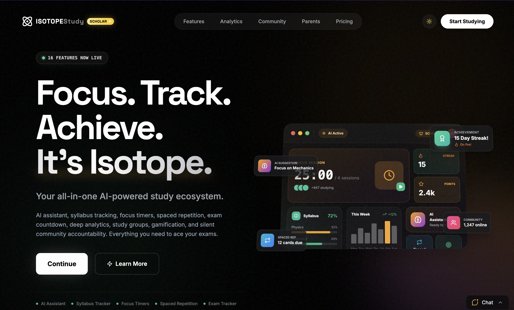

<p align="center">
  
</p>

<h1 align="center">IsotopeAI</h1>

<p align="center">
  A study app you run on your own device.
</p>

<p align="center">
  <a href="./CHANGELOG.md"></a>
  <a href="https://suydev.github.io/isotope-code/"></a>
</p>

<p align="center">
  <a href="https://suydev.github.io/isotope-code/">Animated docs</a>
  ·
  <a href="https://suydev.github.io/isotope-code/install.html">Install</a>
  ·
  <a href="https://suydev.github.io/isotope-code/sync.html">Sync safety</a>
  ·
  <a href="https://suydev.github.io/isotope-code/admin.html">Admin proof</a>
  ·
  <a href="https://suydev.github.io/isotope-code/gallery.html">Screenshots</a>
</p>

<p align="center">
  <a href="https://suydev.github.io/isotope-code/gallery.html">
    
  </a>
</p>

It includes:

- Focus timer
- Tasks and subjects
- Study sessions and stats
- Habits, exams, tests, and mock tests
- Optional Supabase login, backup, restore, and community features

Start here:

- Animated web guide: https://suydev.github.io/isotope-code/
- Install guide: https://suydev.github.io/isotope-code/install.html
- Screenshot gallery: https://suydev.github.io/isotope-code/gallery.html
- Admin guide: [ADMIN.md](./ADMIN.md)
- Sync details: [docs/sync-system.md](./docs/sync-system.md)
- Backup storage details: [docs/storage-backup-system.md](./docs/storage-backup-system.md)

## Pick Your Device

### Android with Termux

Install Termux from F-Droid or GitHub, not the old Play Store app.

```bash
bash <(curl -fsSL https://raw.githubusercontent.com/Suydev/isotope-code/main/install-termux.sh)
```

After install:

```bash
isotope start
```

Open:

```text
http://127.0.0.1:3000
```

### Linux

```bash
git clone https://github.com/Suydev/isotope-code.git
cd isotope-code
bash setup.sh
isotope start
```

### macOS

Install Git and Node.js first if you do not have them.

```bash
git clone https://github.com/Suydev/isotope-code.git
cd isotope-code
bash setup.sh
isotope start
```

### Windows

Use PowerShell:

```powershell
git clone https://github.com/Suydev/isotope-code.git
cd isotope-code
.\install.ps1
```

Or use Command Prompt:

```bat
git clone https://github.com/Suydev/isotope-code.git
cd isotope-code
setup.bat
```

Then open:

```text
http://127.0.0.1:3000
```

## What Setup Does

Setup checks for:

- Node.js 18 or newer
- npm
- Git
- `.env`
- required scripts

It then installs the `isotope` command.

## Useful Commands

```bash
isotope start              # start the app
isotope stop               # stop the app
isotope restart            # restart the app
isotope open               # open in browser
isotope update             # update from GitHub
isotope status             # show status
isotope doctor             # find problems
isotope logs               # show logs
isotope repair             # repair install
isotope reinstall-widgets  # Android Termux widget shortcuts
```

## Supabase Setup

The app works best with your own Supabase project.

You need Supabase for:

- login
- sync
- cloud backup
- restore on a new device
- avatars
- groups and community features

Steps:

1. Create a free project at https://supabase.com
2. Open SQL Editor.
3. Paste and run [isotope-complete.sql](./isotope-complete.sql).
4. Create these Storage buckets if they do not already exist:
   - `avatars`
   - `user-content`
   - `notes`
5. Copy your Project URL and anon key.
6. Put them in `.env`.

Example:

```env
SUPABASE_URL=https://your-project-ref.supabase.co
SUPABASE_ANON_KEY=your-anon-public-key
PORT=3000
ENABLE_ADMIN_MODE=false
```

Do not put a service-role key in the browser.

Do not commit `.env`.

## Safe Cloud Backup

The app now uses one backup system.

Main backup:

```text
{userId}/backups/latest.json
```

Backup history:

```text
{userId}/backups/history/{timestamp}-{hash}.json
```

Cloud mirror:

```text
{userId}/cloud-snapshot/latest.json
```

Old folders are still read for safety:

```text
{userId}/imports/latest.json
{userId}/exports/latest.json
{userId}/cloud-snapshot/latest.json
```

Important rule:

If this device is empty and cloud has a richer backup, upload is blocked. The app must restore cloud data first.

Blocked code:

```text
BLOCKED_EMPTY_OVERWRITE
```

## Admin Mode

Admin mode is optional.

Use it only on your own machine.

```env
ENABLE_ADMIN_MODE=true
ADMIN_SECRET=<long-random-secret>
ADMIN_EMAIL=<your-email@example.com>
```

Add `SUPABASE_SERVICE_ROLE_KEY` only in your private `.env` when you need admin repair tools.

Open:

```text
http://127.0.0.1:3000/__admin
```

Useful admin pages:

- `/__admin/verify`
- `/__admin/sync`
- `/__admin/storage`
- `/__admin/roles`
- `/__admin/patch`

## Backup Repair Commands

Dry-run first:

```bash
node scripts/repair-user-backup.mjs --user <user-id> --dry-run
```

Apply only after the dry-run looks safe:

```bash
node scripts/repair-user-backup.mjs --user <user-id> --apply
```

Check backups:

```bash
node scripts/validate-backup-files.mjs --user <user-id>
```

Preview cleanup:

```bash
node scripts/validate-storage-cleanup.mjs --user <user-id> --dry-run
```

## Troubleshooting

| Problem | Try this |
|---|---|
| App does not open | `isotope start` then open `http://127.0.0.1:3000` |
| Port is busy | `isotope stop` or set `PORT=3001` in `.env` |
| Login fails | Check `SUPABASE_URL` and `SUPABASE_ANON_KEY` |
| Sync is blocked | Restore the cloud backup first |
| Storage permission error | Re-run `isotope-complete.sql` |
| Android widget is missing | `isotope reinstall-widgets` |
| Update failed | `isotope doctor`, then `isotope repair` |

## For Contributors

Before changing sync, backup, auth, or SQL:

```bash
node --check server.mjs
node --check server/backup-manager.mjs
node --check public/sync/backup-normalizer.js
node --check public/sync/local-data-adapter.js
node scripts/validate-backup-files.mjs --user <user-id>
node scripts/repair-user-backup.mjs --user <user-id> --dry-run
npm run assets:compare
```

Rules:

- Do not commit `.env`.
- Do not expose service-role keys to the frontend.
- Do not weaken RLS to hide a bug.
- Do not let empty local data overwrite rich cloud data.
- Do not replace compiled assets from the live site unless the asset report proves the same chunk graph is available.
- Keep docs simple and true.

## License

MIT. See [LICENSE](./LICENSE).
